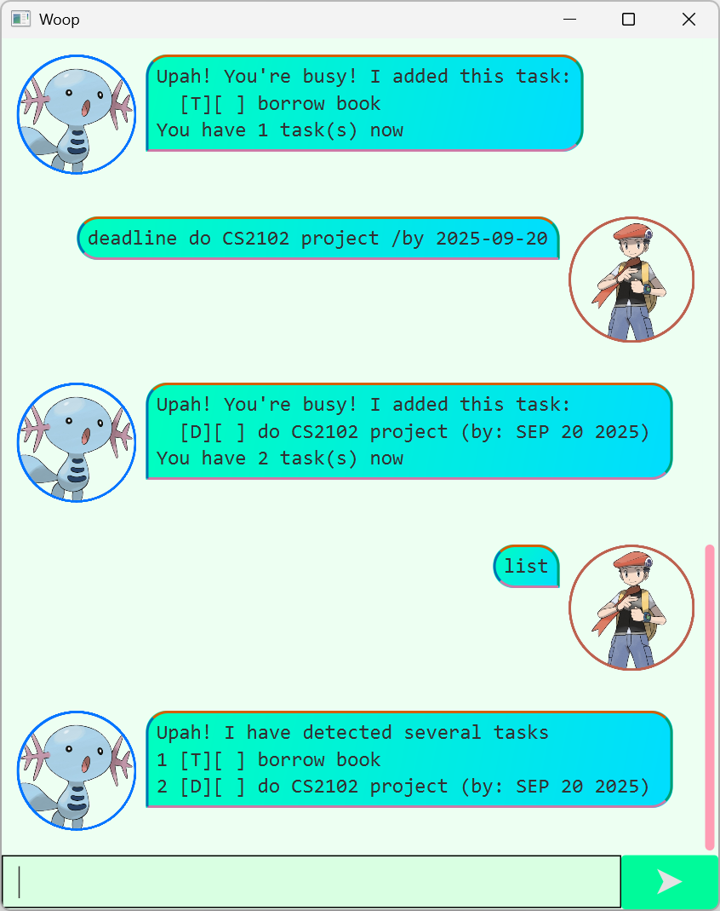

# Woop User Guide



The cutest chatbot in the world! (Will probably swim into rocks too)

## Adding Task

// Describe the action and its outcome.

// Give examples of usage

Example: `keyword (optional arguments)`

// A description of the expected outcome goes here

```
expected output
```

## Feature ABC

// Feature details


## Feature XYZ

// Feature details